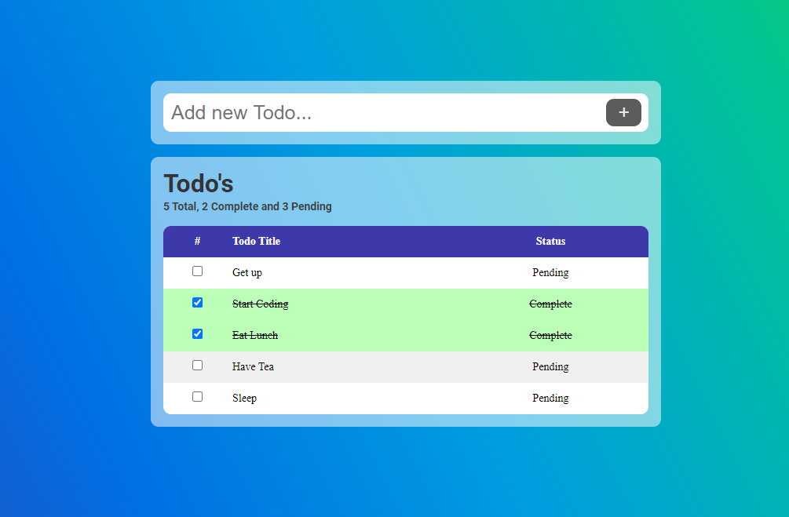

# My Todo App ([Demo](https://softon.github.io/todoapp))

A simple Todo App designed with the help of HTML/CSS & Javascript.

## Features
- Add Todo
- Remove Todo
- Mark / Unmark Todo Complete
- Persistent

## Figma Design
[https://www.figma.com/file/MDw3Kn4fu2lNe3wdebNRyq/Todo?node-id=0%3A1](https://www.figma.com/file/MDw3Kn4fu2lNe3wdebNRyq/Todo?node-id=0%3A1)

## Tutorial Videos
- Part 1 - UI Design in Figma [Open in Youtube](https://youtu.be/B9P1nCaW2v8)
- Part 2 - UI Development in HTML/CSS [Open in Youtube](https://youtu.be/87Y64P1zkfk)
- Part 3 - Lets make it work with the help of Javascript [Open in Youtube](https://youtu.be/z1NbZ2Qus4k)
- Part 4 - Persist Data to Local Storage [Open in Youtube](https://youtu.be/z1NbZ2Qus4k)